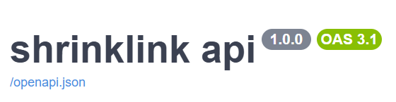

# ShrinkLink Api




> A free Url shortener services

## 📄 Table of Contents

- [About](#about)
- [Key Features](#key-features)
- [Tech Stack](#tech-stack)
- [Getting Started](#getting-started)
  - [Prerequisites](#prerequisites)
  - [Installation](#installation)
- [Usage](#usage)
- [Configuration](#configuration)
- [Roadmap](#roadmap)
- [Contributing](#contributing)
- [License](#license)
- [Contact](#contact)

## 🧐 About

this is a Url shortener services that enables individual to reduces the length of an excessively long Url to a manageable easy to pattern that is easy to read and understand.
i built this project so users can have an easy way to store and use long urls in a easy an intuitive manner.

## ✨ Key Features

* **Feature 1:** A 6 character long, url safe, low collision short string to act as a unique identifier for the long url
* **Feature 2:** Automatic temporary redirect to the original url
* **Feature 3:** A counter that increments upon successful redirect to the original url
* **Feature 4:** Unit testing for each api endpoint and associating operation
* **Feature 5:** Database migration

## 🛠️ Tech Stack
* [Fastapi](https://fastapi.tiangolo.com/)
* [Sqlmodel](https://sqlmodel.tiangolo.com/)
* [Sqlalchemy](https://www.sqlalchemy.org/)
* [pydantic](https://docs.pydantic.dev/latest/)
* [psycopg2](https://pypi.org/project/psycopg2/)
* [PostgreSQL](https://www.postgresql.org/)
* [Alembic](https://alembic.sqlalchemy.org/)
* [Pytest](https://pytest.org/)

## 🚀 Getting Started

Follow these instructions to get a copy of the project up and running on your local machine.

### Prerequisites

List things you need to use the software and how to install them.

**Python**

    make sure python is installed
    
### Installation

1.  **Clone the repo**
    ```sh
    git clone https://github.com/Heritage-XioN/shrink-link-api.git
    ```
2.  **Create and activate Virtual Environment**
    ```sh
    Create
    python -m venv venv

    Activate
    Windows:
    venv\Scripts\activate

    macOS and Linux:
    source venv/bin/activate
    ```

3.  **Install dependencies**
    ```sh
    pip install -r requirements.txt
    ```

4.  **Set up environment variables** (See Configuration below)

5.  **Run the application**
    ```sh
    fastapi dev app/main.py
    ```

## 🎮 Usage

Visit the interactive docs

```
http://127.0.0.1:8000/docs
```

## ⚙️ Configuration

To run this project, you will need to create a `.env` file in the root directory. Add the following environment variables:

| Variable | Description | Example Value |
| :--- | :--- | :--- |
| `DB_PORT` | The port the application runs on | `3000` (or `8000`) |
| `DB_HOSTNAME` | Database hostname string | `localhost`
| `DB_PASSWORD` | Database password string | `password123`
| `DB_NAME` | Database name | `postgres`
| `TEST_DB_NAME` | test database name | `postgres_test`
| `DB_USERNAME` | Database user name | `postgres`
| `DB_DRIVER` | database driver | `postgres`
| `SECRET_KEY` | Secret key for JWT or Sessions | `your_super_secret_key_123` |
| `ACCESS_TOKEN_EXPIRE_MINUTES` | JWT expiration time | `1440` |
| `ALGORITHM` | JWT encryption algorithm | `HS256` |
| `BACKEND_URL` | Backend url | `http://localhost:8000` |

## 🗺️ Roadmap

Here are the planned features and improvements for future updates:

- **Data cache:**  Add logic for caching frequently visited url to reduce database read and write operation.


See the [open issues](https://github.com/your_username/repo_name/issues) for a full list of proposed features (and known issues).

## 🤝 Contributing

Contributions are what make the open source community such an amazing place to learn, inspire, and create. Any contributions you make are **greatly appreciated**.

1.  **Fork the Project**

2.  **Create your Feature Branch**
    ```bash
    git checkout -b feature/AmazingFeature
    ```

3.  **Commit your Changes**
    ```bash
    git commit -m 'Add some AmazingFeature'
    ```

4.  **Push to the Branch**
    ```bash
    git push origin feature/AmazingFeature
    ```

5.  **Open a Pull Request**

## 📜 License

Distributed under the MIT License. See `LICENSE` for more information.

## 📧 Contact

**HERITAGE IYOKE**

- **GitHub:** [@Heritage-XioN](https://github.com/Heritage-XioN/)
- **LinkedIn:** [Your Profile](https://linkedin.com/in/your_profile)
- **Email:** iheritage934@gmail.com

**Project Link:** [https://github.com/your_username/repo_name](https://github.com/your_username/repo_name)